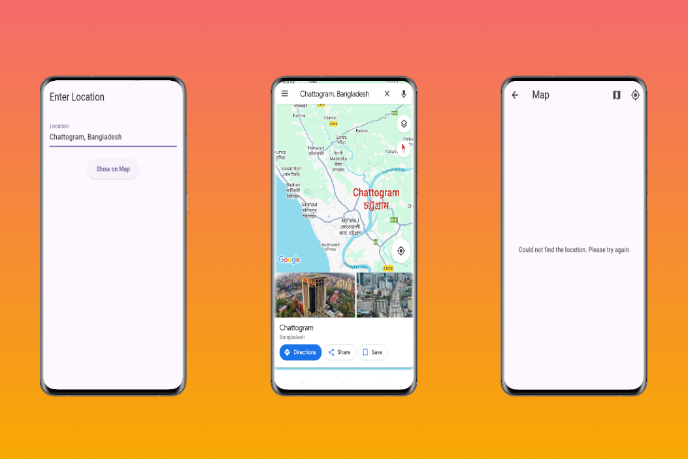

# Simple Location-Based Flutter App

This is a simple Flutter app that allows users to input a location and display it on a map. Users can enter a city name, address, or coordinates. The app features map type switching and allows users to display their current location on the map as well.

## Features:
- **Location Input**: Users can enter a location through a text field.
- **Display Location on Map**: The entered location is displayed on the map.
  
## Technologies Used
- Flutter
- Dart
- Google Maps Flutter package and APIs.

## Screenshots:
###  Location App Screen:

